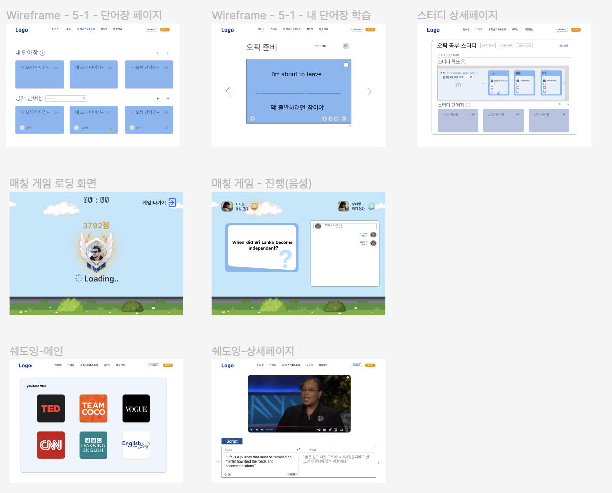
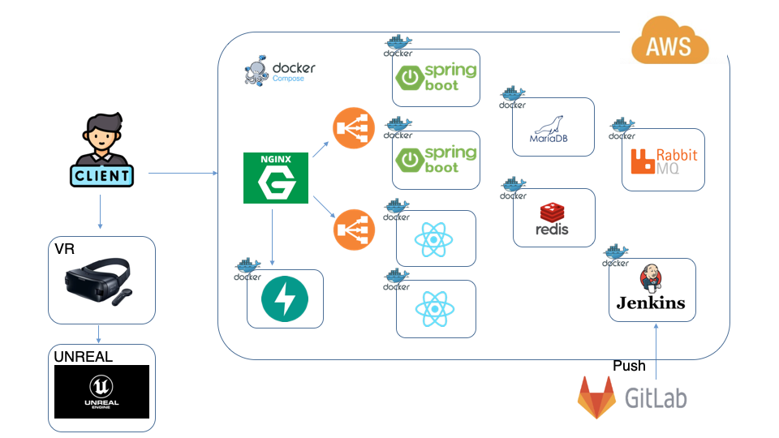
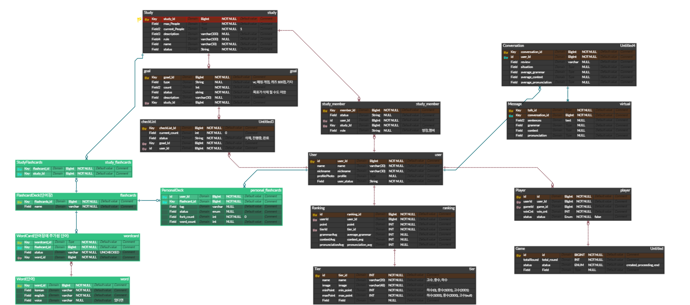

# 🗣️ 말해Vr
---

### 📜 contents
 1. [프로젝트 설명](https://lab.ssafy.com/s09-final/S09P31A501/-/blob/develop/README.md#%ED%94%84%EB%A1%9C%EC%A0%9D%ED%8A%B8-%EC%84%A4%EB%AA%85)
 2. [주요 기능](https://lab.ssafy.com/s09-final/S09P31A501/-/blob/develop/README.md#%EC%A3%BC%EC%9A%94-%EA%B8%B0%EB%8A%A5)
 3. [서비스 화면](https://lab.ssafy.com/s09-final/S09P31A501/-/blob/develop/README.md#%EC%84%9C%EB%B9%84%EC%8A%A4-%ED%99%94%EB%A9%B4)
 4. [개발 환경](https://lab.ssafy.com/s09-final/S09P31A501/-/blob/develop/README.md#%EA%B0%9C%EB%B0%9C-%ED%99%98%EA%B2%BD)
 5. [프로젝트 파일 구조](https://lab.ssafy.com/s09-final/S09P31A501/-/blob/develop/README.md#%ED%94%84%EB%A1%9C%EC%A0%9D%ED%8A%B8-%ED%8C%8C%EC%9D%BC-%EA%B5%AC%EC%A1%B0)
 6. [시스템 아키텍처](https://lab.ssafy.com/s09-final/S09P31A501/-/blob/develop/README.md?ref_type=heads#%EF%B8%8F%EC%8B%9C%EC%8A%A4%ED%85%9C-%EC%95%84%ED%82%A4%ED%85%8D%EC%B2%98)
 7. [기획 및 설계 산출물](https://lab.ssafy.com/s09-final/S09P31A501#%EF%B8%8F%EA%B8%B0%ED%9A%8D-%EB%B0%8F-%EC%84%A4%EA%B3%84-%EC%82%B0%EC%B6%9C%EB%AC%BC)
 8. [팀원 소개](https://lab.ssafy.com/s09-final/S09P31A501#%ED%8C%80%EC%9B%90-%EC%86%8C%EA%B0%9C) 

## 📣프로젝트 설명
| 진행 기간 | 2023.10.09 ~ 2023.11.17 (7주) |
| --- | --- |
### ❗개요

말해Vr는 VR 내 AI와 회화 연습을 제공하며, 웹 사이트에서 추가적인 영어 학습이 가능한 서비스입니다.

### ❓ 기획 의도


> 비대면 외국어 학습 수요 증가

> 디지털 영어학습 시장, AI 영어학습 솔루션 트렌드

> AR 및 VR 시장 2027년까지 25.3% 성장 전망

## 💡주요 기능

---

-   ### VR

    -   문을 통해 My Room에서 NPC들과 대화할 수 있는 장소로 이동할 수 있습니다.
    -   맵에서는 사용자들이 STT와 TTS를 사용하여 NPC와 실제와 같은 환경에서 대화를 실습할 수 있습니다. 
    -   이전에 진행한 대화 목록을 확인하고, 대화를 선택해 주고 받은 대화를 확인할 수 있습니다.
        
        <br/>

-   ### 대화 기록

    -   VR에서 진행한 사용자의 대화 내역을 기록합니다.
    -   진행한 대화에 대한 문맥, 문법 평가를 제공합니다.
    -   대화 평가 추이를 통해 사용자의 대화 능력 향상을 확인할 수 있습니다.
    -   단어장에 대화 문장을 추가할 수 있게 하여 단어 학습을 도와줍니다.

         <br/>

-   ### 매칭 게임

    -   티어 기반으로 매칭을 진행하여 게임을 즐길 수 있습니다.
    -   1:1 단어 맞추기 게임을 통해 단어력을 향상시킬 수 있습니다.
    -   STT를 활용하여 채팅 뿐만 아니라 음성 입력으로 게임을 진행할 수 있습니다.

         <br/> 

-   ### 스터디

    -   1주일단위의 목표 스프린트를 설정하여 스터디를 진행할 수 있습니다.
    -   방장이 등록한 목표들이 스터디 회원들의 체크리스트에 자동으로 추가됩니다.
    -   활동(VR,매칭 게임)을 진행하면 체크리스트를 자동으로 반영하여 체크리스트 진행을 도와줍니다.
    -   스터디 단어장 기능을 제공하여 단어 학습을 할 수 있습니다.

         <br/>                 

-   ### 쉐도잉

    -   자막을 제공하여 쉐도잉 학습을 할 수 있습니다.
    -   번역 기능을 제공하여 학습할 수 있습니다.
    -   발음 평가를 통해 정확한 발음을 향상시킬 수 있습니다.

         <br/>         

-   ### 학습 기록

    -   활동 기반으로 학습 잔디를 제공하여 학습의 지속성을 유지할 수 있습니다.

         <br/>         

-   ### 단어장

    -   말해VR에서 제공하는 기본 단어장을 이용하여 사용자들이 단어 학습을 할 수 있습니다.
    -   사용자는 공개 단어장을 포크하여 단어를 추가하고 학습할 수 있습니다.
    -   단어 자동 완성 기능을 제공하여 편리하게 단어를 추가할 수 있습니다.
    -   학습 모드를 제공하여, 단어의 학습 상태를 체크할 수 있고 재학습이 필요한 단어들만 학습할 수 있습니다.
        
        <br/>


## 🎮🌐서비스 화면
---



### VR - My Room

-   My Room에서 문을 열어 NPC(AI)들과 대화할 수 있는 맵으로 이동할 수 있습니다.


<br>

### VR - 맵

-   사용자들이 NPC(AI)들과 상호작용하며 실제와 같은 환경에서 대화할 수 있는 장소입니다.
-   사용자가 학습하는 맵에서 조금 더 현실과 같은 느낌을 줄 수 있도록 일정 시간마다 랜덤한 장소를 향해서 달리거나 걷는 행인들을 배치하였습니다.


<br>

### VR - NPC와 대화

-   사용자들이 실제 NPC(AI)들과 상호작용하며 실제와 같은 환경에서 대화를 실습할 수 있습니다.
-   역할이 부여된 NPC들과 상황에 맞는 대화를 진행할 수 있습니다.


<br>

### VR - 대화 목록

-   이전에 진행한 대화 목록을 확인할 수 있습니다.
-   대화목록에서 대화를 선택해 NPC와 주고 받은 대화를 확인할 수 있습니다.


<br>

### 메인페이지

-   "오늘의 문장"을 제공합니다.

<br>

### 단어장 메인페이지

-   내단어장과 공개단어장을 볼 수 있습니다.
-   공개단어장은 최신순, 포크순, 단어순과 함께 검색을 할 수 있습니다.
-   말해vr에서 제공하는 기본단어장 3개로 영어 단어 학습을 진행할 수 있습니다.


<br>

### 단어장 검색페이지

-   무한스크롤로 검색화면이 제공됩니다.


<br>

### 단어장 상세페이지

-   등록된 단어들을 한 번에 볼 수 있고, 발음을 들을 수 있습니다.
-   학습모드를 통해 단어마다 학습상태를 선택할 수 있습니다. 재학습이 필요한 단어들만 모아서 볼 수 있습니다.
-   공개단어장은 단어 삭제, 추가, 학습상태가 저장되지 않습니다. 그런 경우 단어장을 포크하여 개인 단어장을 만들 수 있습니다.
-    개인단어장은 단어 삭제, 추가, 학습상태가 저장됩니다. 또한 언제든지 학습 초기화를 하여 다시 모든 단어들을 복습할 수 있습니다.


<br>

### 스터디 메인페이지

-   내 스터디랑 모든 스터디를 한 번에 볼 수 있습니다.
-   스터디를 가입하거나 검색할 수 있습니다.

<br>

### 스터디 검색페이지

-   검색 결과에 맞는 스터디들이 무한스크롤로 제공됩니다.

<br>

### 스터디 상세페이지

-   스터디장은 1주일 단위로 목표 스프린트를 설정할 수 있습니다.
-   목표는 VR, 매칭게임, etc 등으로 설정할 수 있습니다.
-   설정된 목표는 자동으로 스터디 팀원들의 체크리스트에 등록됩니다.
-   팀원들이 매칭게임,VR을 진행하면 자동으로 체크리스트에 반영됩니다.
-   팀원들은 개별적으로 체크리스트를 추가하고 완료할 수 있습니다.
-   스터디 단어장을 제공하여 스터디를 효율적으로 사용할 수 있습니다.

<br>

### 내 학습기록 & 통계

-   VR에서 진행한 사용자의 대화 내역과 문맥, 문법 평균 점수를 한 눈에 볼 수 있습니다.
-   대화 평가 추이를 통해 사용자의 대화 능력 향상을 확인할 수 있습니다.

<br>

### 내 학습기록 & 통계 상세페이지

-   VR에서 진행한 대화를 자세히 볼 수 있습니다.

<br>

### 쉐도잉


<br>

### 매칭게임


<br>


### 마이페이지


<br>

## 💻개발 환경

### VR

- Unreal Engine 5.2.1
- Meta XR SDK

### Frontend

- Node JS 18.16.1
- React 18.2.0
- Recoil 0.7.7
- Typescript 5.2.2
- Sockjs 0.3.35

### Backend

- Java
  - Java OpenJDK 17
  - Spring Boot 2.7.17
    - Spring Data JPA 2.7.17
    - Spring Security 2.7.17
    - JUnit 5.8.2
    - Lombok 1.18.26
    - Websocket 2.3.4
    - Querydsl 5.0.0
  - Gradle 7.6
- fastAPI 

### Server

- Ubuntu 20.04 LTS
- Nginx 1.18.0
- Docker 24.0.5
- Docker Compose 1.27.4
- Jenkins 2.401.3
- RabbitMq 3.12.7

### Database

- Mariadb 11.1.2
- Redis 7.2.1

### UI / UX

- Figma

### IDE

- Visual Studio
- Visual Studio Code
- IntelliJ IDEA

### 형상 / 이슈관리

- Gitlab
- Jira


## 📦프로젝트 파일 구조

<details><summary>📂 Backend</summary>

<!-- 📂 backend -->

```
├─📂 .gradle
└─📂 src
    ├─📂 main
    │  ├─📂 java
    │  │  └─📂 com
    │  │      └─📂 npc
    │  │          └─📂 say_vr
    │  │              ├─📂 domain
    │  │              │  ├─📂 flashcards
    │  │              │  │  ├─📂 api
    │  │              │  │  ├─📂 constant
    │  │              │  │  ├─📂 domain
    │  │              │  │  ├─📂 dto
    │  │              │  │  ├─📂 exception
    │  │              │  │  ├─📂 repository
    │  │              │  │  └─📂 service
    │  │              │  ├─📂 game
    │  │              │  │  ├─📂 api
    │  │              │  │  ├─📂 constant
    │  │              │  │  ├─📂 domain
    │  │              │  │  ├─📂 dto
    │  │              │  │  ├─📂 exception
    │  │              │  │  ├─📂 repository
    │  │              │  │  └─📂 service
    │  │              │  ├─📂 study
    │  │              │  │  ├─📂 api
    │  │              │  │  ├─📂 constant
    │  │              │  │  ├─📂 domain
    │  │              │  │  ├─📂 dto
    │  │              │  │  │  ├─📂 requestDto
    │  │              │  │  │  └─📂 responseDto
    │  │              │  │  ├─📂 exception
    │  │              │  │  ├─📂 repository
    │  │              │  │  │  ├─📂 CheckListItemRepository
    │  │              │  │  │  ├─📂 flashcardDeckRepostiory
    │  │              │  │  │  ├─📂 GoalRepository
    │  │              │  │  │  ├─📂 studyDeckRepository
    │  │              │  │  │  ├─📂 studyMemberRepository
    │  │              │  │  │  ├─📂 studyRepository
    │  │              │  │  │  └─📂 WeeklySprintRepository
    │  │              │  │  └─📂 service
    │  │              │  ├─📂 user
    │  │              │  │  ├─📂 api
    │  │              │  │  ├─📂 constant
    │  │              │  │  ├─📂 domain
    │  │              │  │  ├─📂 dto
    │  │              │  │  ├─📂 exception
    │  │              │  │  ├─📂 repository
    │  │              │  │  │  └─📂 activityRepository
    │  │              │  │  └─📂 service
    │  │              │  └─📂 vr
    │  │              │      ├─📂 api
    │  │              │      ├─📂 constant
    │  │              │      ├─📂 domain
    │  │              │      ├─📂 dto
    │  │              │      ├─📂 exception
    │  │              │      ├─📂 repository
    │  │              │      └─📂 service
    │  │              └─📂 global
    │  │                  ├─📂 api
    │  │                  ├─📂 config
    │  │                  │  └─📂 security
    │  │                  ├─📂 constant
    │  │                  ├─📂 dto
    │  │                  ├─📂 entity
    │  │                  ├─📂 error
    │  │                  │  ├─📂 constant
    │  │                  │  └─📂 exception
    │  │                  ├─📂 file
    │  │                  ├─📂 filter
    │  │                  └─📂 util
    │  └─📂 resources
    │      └─📂 data
    └─📂 test
        └─📂 java
            └─📂 com
                └─📂 npc
                    └─📂 say_vr

```
</details>

<details><summary> 📂 Frontend</summary>
<!-- 📂 frontend -->

```
├─📂 public
└─📂 src
    ├─📂 api
    │  ├─📂 constAPI
    │  ├─📂 MatchingGameAPI
    │  ├─📂 MyPageAPI
    │  │  └─📂 ActivityCalendar
    │  ├─📂 MyStudyAnalysisAPI
    │  ├─📂 ShadowingPageAPI
    │  ├─📂 StudyPageAPI
    │  ├─📂 UserPageAPI
    │  └─📂 VocabListAPI
    ├─📂 assets
    │  ├─📂 Etc
    │  ├─📂 MainPageAssets
    │  ├─📂 MatchingGamePageAssets
    │  ├─📂 MygradeAssets
    │  └─📂 YoutubeCard
    ├─📂 components
    │  ├─📂 MatchingGameComponents
    │  │  ├─📂 GameProceedingPage
    │  │  └─📂 WaitingPage
    │  ├─📂 MyPageComponents
    │  │  ├─📂 ActivityCalendar
    │  │  ├─📂 ChangeNicknameModal
    │  │  ├─📂 ChangeProfileModal
    │  │  ├─📂 StudyCard
    │  │  └─📂 WordCard
    │  ├─📂 MyStudyAnalysisComponents
    │  │  └─📂 Translation
    │  ├─📂 ShadowingComponents
    │  │  └─📂 TranslationComponents
    │  ├─📂 StudyComponents
    │  │  └─📂 Icons
    │  └─📂 VocabListComponents
    │      └─📂 Icons
    ├─📂 pages
    │  ├─📂 LoginPage
    │  ├─📂 MainPage
    │  ├─📂 MatchingGamePage
    │  │  ├─📂 constants
    │  │  └─📂 MatchingGameProceedingPage
    │  ├─📂 MyPage
    │  ├─📂 MyStudyAnalysisPage
    │  │  └─📂 MyStudyAnalysisDetailPage
    │  ├─📂 ShadowingPage
    │  │  ├─📂 BBCPage
    │  │  ├─📂 CNNPage
    │  │  ├─📂 ShadowingDetailPage
    │  │  ├─📂 TeamCOCOPage
    │  │  └─📂 TEDPage
    │  ├─📂 SignPage
    │  ├─📂 StudyPage
    │  │  ├─📂 StudyDeckDetailPage
    │  │  └─📂 StudyDetailPage
    │  └─📂 VocabListPage
    │      ├─📂 DeckDetailPage
    │      ├─📂 DeckLearnPage
    │      └─📂 DeckListPage
    └─📂 recoil
```
</details>


<details><summary> 📂 VR</summary>
<!-- 📂 VR -->

```
├─📂 TalkVR
│  ├─📂 Component
│  ├─📂 UI
│  │  ├─📂 Menu
│  │  ├─📂 ConversationList
│  │  ├─📂 ConversationDetail
│  │  └─📂 ConversationOngoing
│  ├─📂 Player
│  │  ├─📂 Pawn
│  │  └─📂 Controller
│  ├─📂 NPC
│  │  ├─📂 AI
│  │  └─📂 Crowd
│  ├─📂 Input
│  │  ├─📂 IMC
│  │  └─📂 IA
│  └─📂 Maps
│      ├─📂 MyRoom
│      └─📂 Venice
└─📂 Asset
    ├─📂 Venice
    │  ├─📂 Texture
    │  ├─📂 Mesh
    │  └─📂 Actor
    └─📂 MyRoom
        ├─📂 Texture
        ├─📂 Mesh
        └─📂 Actor

```
</details>

## 🏗️시스템 아키텍처


## 🗃️기획 및 설계 산출물
- [📝 기능 명세서](https://infrequent-attraction-ca6.notion.site/98b6503f14df47b3a6ec0b11058f408c)
- [🗞️ API 명세서](https://infrequent-attraction-ca6.notion.site/API-a83b368c239f4db1a12b91c81e00e811?pvs=4)
- [🎨 와이어프레임](https://www.figma.com/file/yBIEwfiSadBuUsuk45q1uq/A501?type=design&node-id=0%3A1&mode=design&t=F6tclqYa0DnB3OxV-1)

<details><summary> 🧱 ERD
</summary>

</details>

## 🙌팀원 소개
| 팀원 | 역할 |
| --- | --- |
|[임정현](https://lab.ssafy.com/chfhddl1234)|팀장, Infra, BE, FE|
|[김종원](https://lab.ssafy.com/jkjongwon)|BE, FE|
|[최지원](https://lab.ssafy.com/wldnjs9515)|BE_LEADER, BE, FE|
|[신석철](https://lab.ssafy.com/scshin97)|FE_LEADER, FE|
|[박한샘](https://lab.ssafy.com/phsaem98)|VR, UNREAL|
|[이정준](https://lab.ssafy.com/jjyoyo83)|VR, UNREAL|


